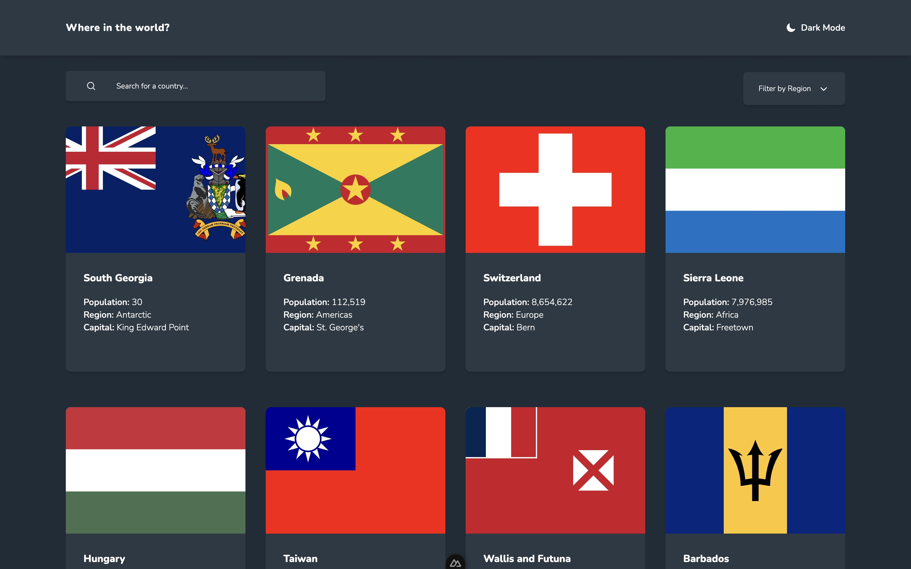

# Frontend Mentor - REST Countries API with color theme switcher solution

## TODO

- [x] Setup fonts
- [x] Setup color theme
- [x] Create API
- [x] Filter by region https://restcountries.com/#endpoints-region
- [x] All https://restcountries.com/v3.1/all
- [x] Filter by name https://restcountries.com/#endpoints-name
- [x] Data used: population, region, capital, flag, name, subregion, languages, borders, currencies, domain
- [x] Fix initial load in home, must be sync with router
- [x] Fix styling, shadow, button style

This is a solution to the [REST Countries API with color theme switcher challenge on Frontend Mentor](https://www.frontendmentor.io/challenges/rest-countries-api-with-color-theme-switcher-5cacc469fec04111f7b848ca). Frontend Mentor challenges help you improve your coding skills by building realistic projects.

## Table of contents

- [Overview](#overview)
  - [The challenge](#the-challenge)
  - [Screenshot](#screenshot)
  - [Links](#links)
- [My process](#my-process)
  - [Built with](#built-with)
- [Author](#author)
- [Setup](#setup)

## Overview

### The challenge

Users should be able to:

- See all countries from the API on the homepage
- Search for a country using an `input` field
- Filter countries by region
- Click on a country to see more detailed information on a separate page
- Click through to the border countries on the detail page
- Toggle the color scheme between light and dark mode _(optional)_

### Screenshot



### Links

- Solution URL: [Github](https://github.com/ulilalb21/where-in-the-world)
- Live Site URL: [Live site](https://where-in-the-world-eight-alpha.vercel.app/)

## My process

### Built with

- Nuxt
- NuxtUI

### Continued development

- Adding cache

## Author

- Website - [Add your name here](https://www.your-site.com)
- Frontend Mentor - [@ulilalb21](https://www.frontendmentor.io/profile/ulilalb21)

## Setup

Make sure to install the dependencies:

```bash
# npm
npm install

# pnpm
pnpm install

# yarn
yarn install

# bun
bun install
```

## Development Server

Start the development server on `http://localhost:3000`:

```bash
# npm
npm run dev

# pnpm
pnpm run dev

# yarn
yarn dev

# bun
bun run dev
```

## Production

Build the application for production:

```bash
# npm
npm run build

# pnpm
pnpm run build

# yarn
yarn build

# bun
bun run build
```

Locally preview production build:

```bash
# npm
npm run preview

# pnpm
pnpm run preview

# yarn
yarn preview

# bun
bun run preview
```

Check out the [deployment documentation](https://nuxt.com/docs/getting-started/deployment) for more information.
